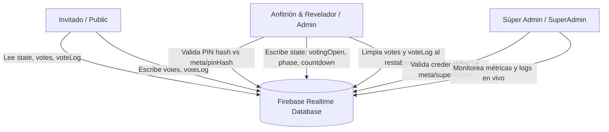

# 👶 Baby Revela — PWA de Revelación de Sexo

PWA interactiva y responsive para revelación de sexo en vivo con votación en tiempo real, cuenta regresiva sincronizada y disparo simultáneo del gran momento.

- **Frontend:** Next.js 16 (App Router), React 19, Tailwind CSS v4, TypeScript
- **Animaciones:** Framer Motion + canvas-confetti
- **Tiempo real:** Firebase Realtime Database (con seguridad por PIN vía reglas SHA-256)
- **PWA:** manifest + service worker + iconos instalables

---

## 🗂 Estructura de carpetas

```
babyrevela/
├── database.rules.json          # Reglas de seguridad de la Realtime Database
├── public/
│   ├── sw.js                    # Service worker (PWA)
│   ├── manifest.ts → /manifest  # Manifest generado por Next.js (src/app/manifest.ts)
│   └── icon-*.png               # Iconos generados
├── scripts/
│   ├── init-db.mjs              # Inicializa la base (PIN hash + estado inicial)
│   └── generate-icons.mjs       # Genera los iconos de la PWA (sin dependencias)
└── src/
    ├── app/
    │   ├── layout.tsx           # Fuentes, metadata PWA, viewport
    │   ├── manifest.ts          # Web App Manifest
    │   ├── page.tsx             # Vista invitado (raíz /)
    │   ├── admin/page.tsx       # Panel del anfitrión (/admin)
    │   └── superadmin/page.tsx  # Panel del súper administrador (/superadmin)
    ├── components/
    │   ├── guest/
    │   │   ├── GuestHome.tsx    # Máquina de estados del invitado
    │   │   ├── NameEntry.tsx    # Ingreso por nombre/apodo
    │   │   ├── VotePanel.tsx    # Votación Team Niño / Team Niña
    │   │   ├── PercentageBar.tsx# Porcentaje de votos en vivo
    │   │   ├── Countdown.tsx    # Cuenta regresiva sincronizada
    │   │   └── RevealScreen.tsx # Revelación final + confetti
    │   ├── admin/
    │   │   ├── AdminLogin.tsx   # Acceso por PIN del anfitrión
    │   │   └── AdminPanel.tsx   # Control del evento + revelación protegida
    │   ├── superadmin/
    │   │   ├── SuperAdminLogin.tsx  # Acceso por nombre + PIN
    │   │   ├── SuperAdminPanel.tsx  # Dashboard de estadísticas + asignación de revelador
    │   │   └── VoteTimeline.tsx     # Gráfica de votos por minuto
    │   └── shared/              # ConnectionPill, FullPageLoader
    └── lib/
        ├── firebase.ts          # Init perezoso del SDK
        ├── db.ts                # Suscripciones y acciones de tiempo real
        ├── confetti.ts          # Burst de confetti por equipo
        ├── constants.ts         # Paleta, textos, configuración
        ├── hash.ts              # SHA-256 del PIN
        ├── storage.ts           # Store cliente (localStorage) con useSyncExternalStore
        └── types.ts
```

---

## 🚀 Configuración en 6 pasos

### 1. Crear el proyecto de Firebase

1. Entra a <https://console.firebase.google.com> y crea un proyecto nuevo.
2. **Build > Realtime Database > Create database** (elige modo producción y región cercana).
3. Copia la `databaseURL` (formato `https://TU-PROYECTO-default-rtdb.firebaseio.com`).
4. Ve a **Configuración del proyecto > Tus apps** y agrega una app **Web**.
   Copia el objeto `firebaseConfig`.

### 2. Configurar variables de entorno

```bash
cp .env.local.example .env.local
```

Completa `NEXT_PUBLIC_FIREBASE_*` con tu configuración y define un **PIN** en `ADMIN_PIN` (mínimo 4 caracteres).

### 3. Cuenta de servicio (para el script de inicialización)

1. En **Configuración del proyecto > Cuentas de servicio**, pulsa *Generar nueva clave privada*.
2. Guarda el JSON como `firebase-service-account.json` en la raíz del proyecto
   (ya está en `.gitignore`).

### 4. Inicializar la base + importar reglas

```bash
npm run init-db
```

El script escribe el hash SHA-256 del PIN en `meta/pinHash` y deja `state` en fase `idle`.

Importa las reglas de seguridad (`database.rules.json`) en:
**Consola de Firebase > Realtime Database > Reglas > Publicar**.

Las reglas hacen que:
- El **PIN** nunca viaje al navegador: solo su hash vive en la base.
- Solo quien envíe `pinHash` correcto pueda escribir en `state`
  (votaciones, cuenta regresiva, revelación).
- Cualquier invitado pueda votar con `{ name, team, updatedAt }` válido.

> 🔁 Si cambias el PIN, vuelve a ejecutar `npm run init-db`.

### 5. Ejecutar

```bash
npm install
npm run dev
```

- Invitados: `http://localhost:3000`
- Anfitrión: `http://localhost:3000/admin` (PIN configurado)

> 💡 Prueba en **dos navegadores o dispositivos** para ver la sincronización en vivo.
> Tip: comparte la app en tu red local con `npm run dev -- -H 0.0.0.0` o despliega.

### 6. Desplegar (producción + PWA)

```bash
npm run build
npm run start
```

O despliega a Vercel / Firebase Hosting (requiere HTTPS para el service worker).

---

## 🎛 Flujo del evento

| # | Acción | Resultado |
|---|--------|-----------|
| 1 | Anfitrión: *Abrir votaciones* | Aparece Team Niño / Team Niña + barra de % en vivo |
| 2 | Invitados votan | Los porcentajes y el historial se actualizan al instante en todos |
| 3 | Anfitrión: *Cerrar votaciones* | Se congelan los resultados |
| 4 | Anfitrión selecciona tiempo y pulsa **REVELAR NIÑO/NIÑA** | Inicia cuenta regresiva automática (5s/10s/15s/30s) |
| 5 | Fin de cuenta regresiva | Explosión simultánea de confetti + tarjeta con mensaje personalizado |

---

## 👑 Súper administrador (`/superadmin`)

Acceso desde la ruta `/superadmin` o desde el botón en `/admin`. Credenciales por defecto: **ChrizDev / 3008** (configurables en `.env.local`).

- **Dashboard en tiempo real:** total de votos, conteo y % por equipo, fase actual, barra de porcentaje, gráfica de votos por minuto y listado de los últimos votos con nombre y hora.

---

## 🛡️ Diagrama de Permisos y Roles



| Rol | Ruta | Credenciales / Auth | Permisos en Realtime Database |
|---|---|---|---|
| **Invitado** | `/` | Nombre / Apodo | Lectura pública de `meta`, `state`, `votes`, `voteLog`. Escritura de sus votos en `votes/$uid` y `voteLog/$id`. |
| **Anfitrión / Revelador** | `/admin` | `ADMIN_PIN` (hash SHA-256 vs `meta/pinHash`) | Control de votaciones, cuenta regresiva automática y reset completo de la base (`state`, `votes`, `voteLog`). |
| **Súper Admin** | `/superadmin` | `SUPER_ADMIN_NAME` + `SUPER_ADMIN_PIN` (vs `meta/superAdmin`) | Monitoreo en tiempo real de estadísticas, timeline de votos y log detallado. |

---

## 🔐 Sobre la seguridad

- El panel `/admin` se desbloquea comparando el hash SHA-256 del PIN contra `meta/pinHash`. El PIN puro no se envía ni se almacena en el cliente.
- Al restablecer el evento desde el panel del Anfitrión, se borran automáticamente los nodos `votes` y `voteLog` de Firebase, dejando la base limpia para un nuevo evento.
- **Desarrollado con ❤️ por ChrizDev**.
